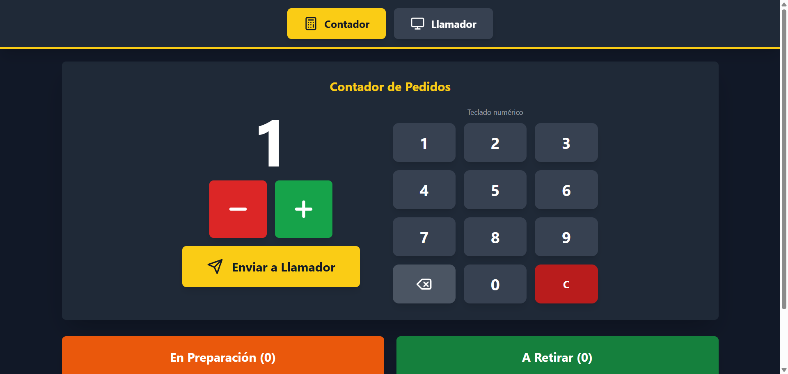
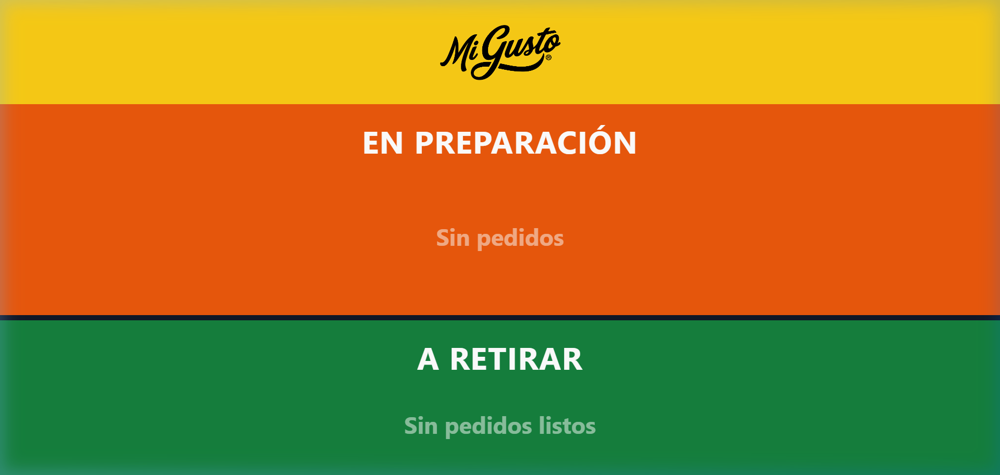

  

  # 📣 Mi Gusto — Llamador de Pedidos

  **Sistema táctil y display inteligente de gestión de pedidos 100% offline**

  
  
  
  
  

---

### 💡 Sobre el Proyecto

**Mi Gusto — Llamador de Pedidos** es una solución web de alto rendimiento, diseñada para operar en **entornos de despacho dinámicos** donde la velocidad, la claridad visual y la autonomía de conexión son críticas.

Diseñado específicamente para **puntos de venta, food trucks, eventos multitudinarios y ferias gastronómicas**, permite sincronizar en tiempo real el armado de órdenes con la pantalla de llamado para los clientes, sin depender de servidores externos ni conexión a Internet.

---

## 🖼️ Vistas del Sistema

<table align="center" style="border-collapse: collapse; border: none; width: 100%;">
  <tr>
    <td align="center" width="50%" style="border: none; padding: 10px;">
      
       
      <b>🧮 Panel Contador — Control Táctil</b>
    </td>
    <td align="center" width="50%" style="border: none; padding: 10px;">
      
       
      <b>📺 Vista Llamador — Display de Turnos</b>
    </td>
  </tr>
  <tr>
    <td align="center" width="50%" style="border: none; padding: 10px;">
      
       
      <b>⚡ Gestión en Tiempo Real</b>
    </td>
    <td align="center" width="50%" style="border: none; padding: 10px;">
      
       
      <b>🎯 Pantalla de Retiro Optimizada</b>
    </td>
  </tr>
</table>

---

## ✨ Características Principales

- ⚡ **100% Offline & Resiliente**  
  Sin dependencia de APIs externas o servidores cloud. Persistencia inmediata mediante `localStorage` que garantiza cero pérdida de datos ante reinicios.

- 📱 **Interfaz Táctil Ergonométrica (Vista Contador)**  
  Controles oversized (+1, -1, Enviar) diseñados para operarios en cocinas o mostradores táctiles de ritmo rápido.

- 📺 **Display de Gran Formato (Vista Llamador)**  
  Diseño adaptativo de alto contraste pensado para televisores de 55"+ verticales (1080x1920) y pantallas de despacho visibles a distancia.

- 🔄 **Flujo de Trabajo Dinámico en 2 Etapas**  
  - **En Preparación**: Los pedidos recién emitidos se posicionan en el sector superior.
  - **A Retirar**: Transición con un tap para alertar al cliente en la zona de entrega.

- 🎯 **Sincronización Multiventana Instantánea**  
  Escucha activa de eventos de almacenamiento (`storage event`) para actualizar ambas pantallas simultáneamente en milisegundos.

---

## 🛠️ Tecnologías Clave

| Tecnología | Rol en el Sistema | Beneficio Clave |
| :--- | :--- | :--- |
| **React 18** | UI Framework | Renderizado reactivo y componentes modulares |
| **TypeScript** | Lenguaje | Tipado estricto para estados de pedidos y eventos |
| **Tailwind CSS** | Estilos | Diseño responsivo con paleta cromática de alta visibilidad |
| **Vite** | Bundler & Architecture | Multi-entry build optimizado para distros offline |
| **Lucide Icons** | Iconografía | Simbología limpia e intuitiva |

---

## 🎯 Casos de Uso Ideal

- 🍔 **Food Trucks & Stand Gastronómicos**
- 🍕 **Locales de Comida Rápida & Delivery**
- 🎪 **Ferias, Festivales & Eventos Masivos**
- 🛍️ **Puntos de Retiro de Mercadería & Takeaway**

---

## 👥 Desarrolladores

| Desarrollador | Enlaces |
| :--- | :--- |
| **Facundo Carrizo** |   |
| **Ramiro Lacci** |   |

 

  Desarrollado con ❤️ para el ecosistema <b>Mi Gusto</b>

